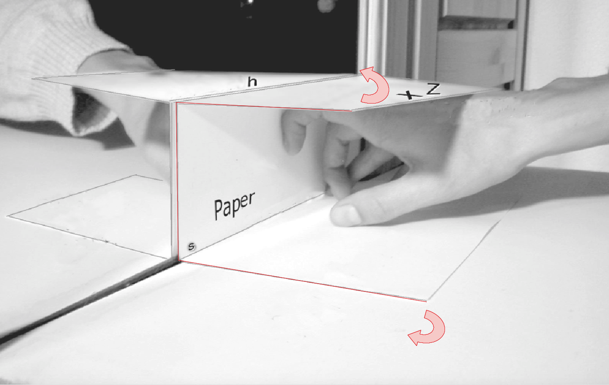

# 3D Construction of Projections in Geogebra
The repository contains Geogebra files for learning 3D projections on a mirror Z-, X, and I-construction of 3D point and lines.
This repository is created for the [Wikiversity Learning Resource about Perspective Drawing](https://en.wikiversity.org/wiki/Perspective_Drawing_on_Mirror) - https://en.wikiversity.org/wiki/Perspective_Drawing_on_Mirror

## Basic Geometry in Front of the Mirror
The perspective drawing creates an image of an object in front of a mirror. The eye observing the projective image from a point Z. 
Assume the observer is painting the perspective image of a vertical line/stick on the surface of the mirror.

Considering the perpective construction from the side will lead to the following situation.

## Basic Situation in Front of a Mirror
The following image shows the basic situation of a 3D projection on a mirror. The perspective image of the box is painted on the mirror.

## Use a Paper as Mediator between 3D and 2D Construction 
You can use a paper as mediator between the 3D world and the 2D projection on the paper.

## Z-Construction for Lines on a Surface
A Z-construction generates perspective image of a half-line. 

## X-Construction for Point on a Surface
The X-construction creates the perspective image of point by using 2 Z-constructions.

## I-Construction for a Vertical Line
The I-construction creates the perspective image of vertical line segment by using 2 X-constructions.

## 3D-Object generated with Z-,X- and I-Construction

## Further Information
This repository was created with [Geogebra](https://en.wikipedia.org/wiki/Geogebra) and created for a [Wikiversity Learning Resource for Perspective Drawing](https://en.wikiversity.org/wiki/Perspective_Drawing_on_Mirror) - https://en.wikiversity.org/wiki/Perspective_Drawing_on_Mirror .
A german article is available in the Journal Mathematica Didactica 26 (2003) Bd.1 43, Experimenteller Umgang mit Spiegelung und Perspektive unter Verwendung von Dynamischer Geometriesoftware

Engelbert Niehaus