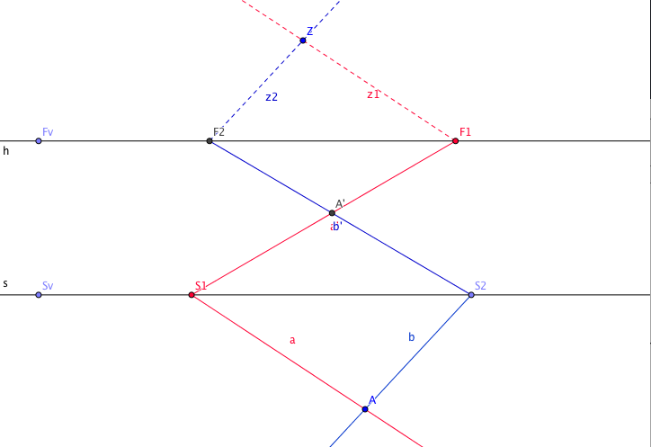

# 3D Construction of Projections in Geogebra
The repository contains Geogebra files for learning 3D projections on a mirror Z-, X, and I-construction of 3D point and lines.

## Basic Geometry in Front of the Mirror
The perspective drawing creates an image of an object in front of a mirror. The eye observing the projective image from a point Z. 
Assume the observer is painting the perspective image of a vertical line/stick on the surface of the mirror.

Considering the perpective construction from the side will lead to the following situation.

## Z-Construction for Lines on a Surface

## X-Construction for Point on a Surface

## I-Construction for a Vertical Line

## 3D-Object generated with Z-,X- and I-Construction

## Further Information
This repository was created with [Geogebra](https://en.wikipedia.org/wiki/Geogebra) and created for a [Wikiversity Learning Resource for Perspective Drawing](https://en.wikipedia.org/wiki/Perspective_Drawing_on_Mirror) - https://en.wikipedia.org/wiki/Perspective_Drawing_on_Mirror .
A german article is available in the Journal Mathematica Didactica 26 (2003) Bd.1 43, Experimenteller Umgang mit Spiegelung und Perspektive unter Verwendung von Dynamischer Geometriesoftware

Engelbert Niehaus